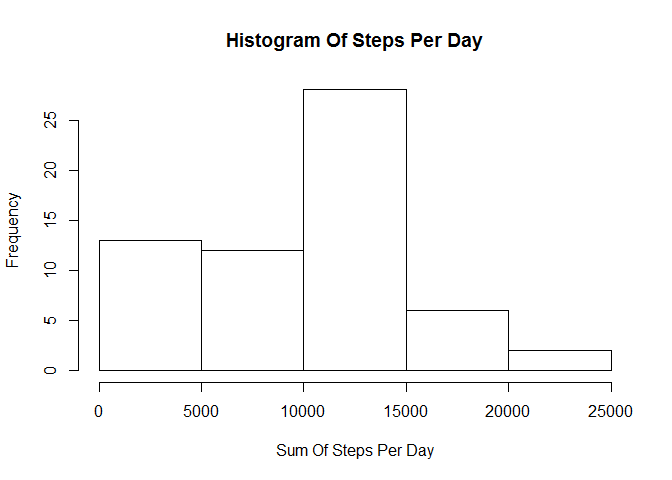
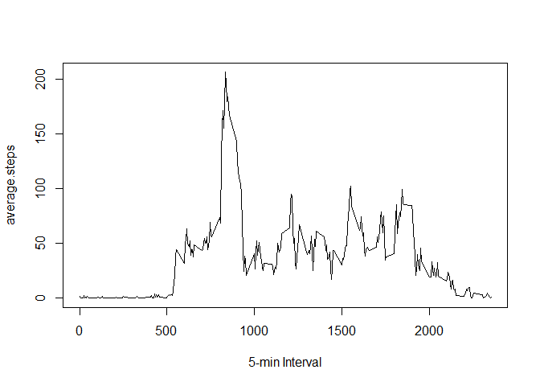
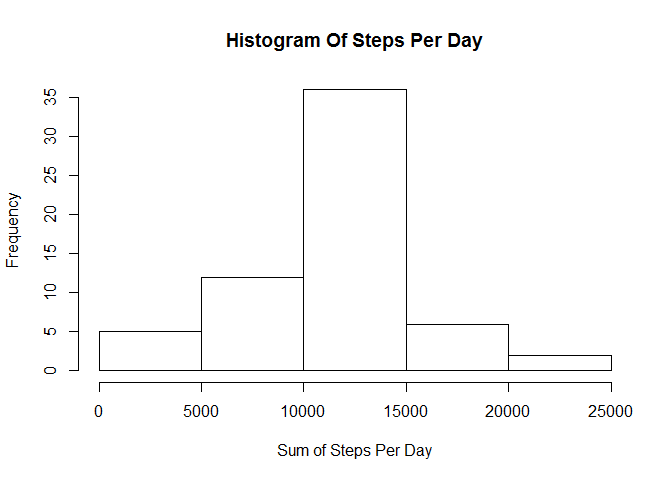

# Reproducible Research: Peer Assessment 1
**By Che Pakrul Azmi 26-12-2016**

##**Loading and preprocessing the data**
i - Set path (My path is "E:/JHU/Course5/project1")

```r
echo = TRUE
getwd()
```

```
## [1] "E:/JHU/Course5/project1"
```

```r
setwd("E:/JHU/Course5/project1")
```

ii - Get the data

```r
echo = TRUE
if(!file.exists('data')) dir.create('data')
fileUrl <- 'https://d396qusza40orc.cloudfront.net/repdata%2Fdata%2Factivity.zip'
download.file(fileUrl, destfile = './repdata_data_activity.zip')
```

iii - Unzip data

```r
echo = TRUE
unzip('./repdata_data_activity.zip', exdir = './data')
activity <- read.csv("./data/activity.csv")
```

iv - The variable created during by this code are set to NULL.

```r
echo = TRUE
df_summary <- NULL
total.steps <- NULL
total.steps2 <- NULL
minute.interval <- NULL
activity2 <- NULL
mean.total.steps2 <- NULL
median.total.steps2 <- NULL
activity2_weekend <- NULL
activity2_weekday <- NULL
mean_activity2_weekday <- NULL
mean_activity2_weekend <- NULL
```

**QUESTION**

##**A-What is mean total number of steps taken per day?**

i - The total (sum) of steps is determined for every single date.


```r
echo = TRUE
total.steps <- tapply(activity$steps, activity$date, sum, na.rm=TRUE)
```

ii - Histogram of the total number of steps taken each day.


```r
echo = TRUE
hist(total.steps, xlab = "Sum Of Steps Per Day", main = "Histogram Of Steps Per Day")
```

<!-- -->

```r
png(filename="./figure/Hist_Steps_Per_Day.png",width=800,height=600,units="px")
```

iii - The mean and the median total number of steps taken per day are reported:

```r
echo = TRUE
mean.total.steps <- round(mean(total.steps))
print(c("The mean is",mean.total.steps))
```

```
## [1] "The mean is" "9354"
```


```r
echo = TRUE
median.total.steps <- round(median(total.steps))
print(c("The median is",median.total.steps))
```

```
## [1] "The median is" "10395"
```

##**B-What is the average daily activity pattern ?**

i - A time series plot of the 5-minute interval and the average number of steps taken (averaged across all days) is shown below:

**Histogram 5-minute interval and the average number of steps taken**

```r
echo = TRUE
average.steps <- tapply(activity$steps, activity$interval, mean, na.rm=TRUE)
plot(average.steps ~ unique(activity$interval), type="l", xlab = "5-min Interval")
```

<!-- -->

```r
png(filename="./figure/Hist_5min_Interval.png",width=800,height=600,units="px")
```

ii - The 5-minute interval (on average across all the days in the dataset) that contains the maximum number of steps is the following (below are shown the interval showing the max. number of steps and the value of the max. number of steps):

```r
echo = TRUE
average.steps[which.max(average.steps)]
```

```
##      835 
## 206.1698
```

##**C - Imputing missing values**

Note that there are a number of days/intervals where there are missing values (coded as NA). The presence of missing days may introduce bias into some calculations or summaries of the data.

i - First, in order to visualize in which variable the NAs are:

```r
echo = TRUE
table(is.na(activity) == TRUE)
```

```
## 
## FALSE  TRUE 
## 50400  2304
```

```r
echo = TRUE
summary(activity)
```

```
##      steps                date          interval     
##  Min.   :  0.00   2012-10-01:  288   Min.   :   0.0  
##  1st Qu.:  0.00   2012-10-02:  288   1st Qu.: 588.8  
##  Median :  0.00   2012-10-03:  288   Median :1177.5  
##  Mean   : 37.38   2012-10-04:  288   Mean   :1177.5  
##  3rd Qu.: 12.00   2012-10-05:  288   3rd Qu.:1766.2  
##  Max.   :806.00   2012-10-06:  288   Max.   :2355.0  
##  NA's   :2304     (Other)   :15840
```

**All of the NA's are in the steps variable. There are 2304 NA's.**

ii - Strategy for filling in all of the missing values in the dataset

**The following strategy is chosen: for any NA is the step variable, the mean (of steps) of the corresponding interval is taken as the replacing value.**

iii - The 'average.steps' contains the mean for each single interval calculated over the 61 days. The right value coming from 'average.steps' is going to be used to replace the NA at the same interval.


```r
echo = TRUE
activity2 <- activity  # creation of the dataset that will have no more NAs
for (i in 1:nrow(activity)){
    if(is.na(activity$steps[i])){
        activity2$steps[i]<- average.steps[[as.character(activity[i, "interval"])]]
    }
}
```
iv - Below is a histogram of the total number of steps taken each day. The mean and median total number of steps taken per day are reported.
**Histogram of Steps per Day**

```r
echo = TRUE
total.steps2 <- tapply(activity2$steps, activity2$date, sum, na.rm=TRUE)
hist(total.steps2, xlab = "Sum of Steps Per Day", main = "Histogram Of Steps Per Day")
```

<!-- -->

```r
png(filename="./figure/Hist_Sum_Steps_Per_Day.png",width=800,height=600,units="px")
```

The new values are :

```r
echo = TRUE
mean.total.steps2 <- round(mean(total.steps2))
print(c("The mean is",mean.total.steps2))
```

```
## [1] "The mean is" "10766"
```

```r
echo = TRUE
median.total.steps2 <- round(median(total.steps2))
print(c("The median is",median.total.steps2))
```

```
## [1] "The median is" "10766"
```


v - In order to compare the new values with the "old" values:

```r
echo = TRUE
df_summary <- rbind(df_summary, data.frame(mean = c(mean.total.steps, mean.total.steps2), median = c(median.total.steps, median.total.steps2)))
rownames(df_summary) <- c("with NA's", "without NA's")
print(df_summary)
```

```
##               mean median
## with NA's     9354  10395
## without NA's 10766  10766
```

For comparison with NAs and without (see earlier):

```r
echo = TRUE
summary(activity2)
```

```
##      steps                date          interval     
##  Min.   :  0.00   2012-10-01:  288   Min.   :   0.0  
##  1st Qu.:  0.00   2012-10-02:  288   1st Qu.: 588.8  
##  Median :  0.00   2012-10-03:  288   Median :1177.5  
##  Mean   : 37.38   2012-10-04:  288   Mean   :1177.5  
##  3rd Qu.: 27.00   2012-10-05:  288   3rd Qu.:1766.2  
##  Max.   :806.00   2012-10-06:  288   Max.   :2355.0  
##                   (Other)   :15840
```

```r
head(activity2)
```

```
##       steps       date interval
## 1 1.7169811 2012-10-01        0
## 2 0.3396226 2012-10-01        5
## 3 0.1320755 2012-10-01       10
## 4 0.1509434 2012-10-01       15
## 5 0.0754717 2012-10-01       20
## 6 2.0943396 2012-10-01       25
```

**It confirms there is no more NAs in the steps variable.**

##**D - Are there differences in activity patterns between weekdays and weekends?**

i - A new column is added to the dataframe, this column will contain the factor "weekday days" or "weekend days".

```r
echo = TRUE
activity2$weekday <- c("weekday")
activity2[weekdays(as.Date(activity2[, 2])) %in% c("Saturday", "Sunday"), ][4] <- c("weekend")
table(activity2$weekday == "weekend")
```

```
## 
## FALSE  TRUE 
## 12960  4608
```

```r
activity2$weekday <- as.factor(activity2$weekday)
```
ii - In order to visualize the difference bewteen weekends and days of the week, a new dataframe is created to be usable by the lattice package. First, the data are calculated:


```r
echo = TRUE
activity2_weekend <- subset(activity2, activity2$weekday == "weekend")
activity2_weekday <- subset(activity2, activity2$weekday == "weekday")

mean_activity2_weekday <- tapply(activity2_weekday$steps, activity2_weekday$interval, mean)
mean_activity2_weekend <- tapply(activity2_weekend$steps, activity2_weekend$interval, mean)
```

iii - Then the dataframe is prepared and plotted !

```r
echo = TRUE
library(lattice)
df_weekday <- NULL
df_weekend <- NULL
df_final <- NULL
df_weekday <- data.frame(interval = unique(activity2_weekday$interval), avg = as.numeric(mean_activity2_weekday), day = rep("weekday", length(mean_activity2_weekday)))
df_weekend <- data.frame(interval = unique(activity2_weekend$interval), avg = as.numeric(mean_activity2_weekend), day = rep("weekend", length(mean_activity2_weekend)))
df_final <- rbind(df_weekday, df_weekend)

xyplot(avg ~ interval | day, data = df_final, layout = c(1, 2), 
type = "l", ylab = "Number of steps")
```

<!-- -->

```r
png(filename="./figure/Hist_Number_Of_Steps.png",width=800,height=600,units="px")
dev.off()
```

```
## png 
##   2
```

**Yes, it does look like there are differences in activity patterns between weekdays and weekends. During weekdays, there is a peak in activity early in the day and then little activity the rest of the day. During weekends, the activity is consistently slightly higher over the day, but without the peak seen on weekdays.**
